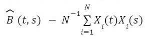
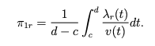

1)  Con relación a los operadores lineales y al espacio de las funciones cuadrado integrables:

    a\. Explique por qué el espacio de las funciones continuas no es un espacio adecuado para representar las observaciones funcionales.

Según el libro, se pueden definir espacios adecuados para cada conjunto de datos, por ejemplo: En el caso más simple, los números escalares pertenecen al espacio definido en la linea recta o números reales; en estadística multivariada, los datos son vectores que pertenecen a $R^d$ donde $d$ es la dimensión del vector. Para el caso de datos funcionales, se considera un espacio de dimensión infinita aunque las funciones sean observadas en tiempos discretos. El primer paso consiste en tomar las observaciones en los puntos discretos y convertirlos en objetos funcionales usando bases de expansión; por lo tanto, si consideramos una base de funciones trigonométricas obtenemos funciones continuas definidas en un intervalo $[a, b]$, es decir que se heredan las propiedades de las base. Teniendo en cuenta lo anterior y si adicionalmete agregamos la restricción de que las funciones deben ser diferenciables $n$ veces, encontramos que el espacio más apropiado para definir estás funciones es el espacio $L^2$, el espacio de funciones ciadrado integrables.

b)  Explique por que la igualdad en el espacio $L^2$ es en el sentido de casi siempre.

c)  Qué propiedades tiene el operador de covarianza? Según el teorema 11.2.2 del libro $Kokoszka, P., & Reimherr, M. (2017)$, las propiedades de un operador de covariaza $C$ de un conjunto de funciones aleatorias cuadrado integrables son:

    1)  $C$ es simétrico.
    2)  $C$ es definido no negativo.
    3)  La suma de los valores propios de $C$ es finita.

d)  De acuerdo a las propiedades que presenta el operador de covarianza, presente una descomposición adecuada de este operador.

De acuerdo a las propiedades vistas anteriormente, podemos decir que B es un operador acotado de Hilbert-Schmidt, por lo cual admite la siguiente descomposición:


Donde $\lambda_i$ son escalares, $u_i$ es una base ortonormal, y:


e)  Sea $Ψ$ un operador integral con el kernel gaussiano $ψ(t, s) = α exp(−(t^2 + s^2)/2)$.

<!-- -->

1)  Para que valores de $\alpha$ $Ψ$ es un operador de Hilbert-Schmidt.

Un Operador es de Hilbert Schmidt si la serie {$\lambda_n^2$} de los coeficientes de la descomposición espectral del operador es convergente, es decir,

Para $\Psi = \sum_{n=1}^\infty \lambda_n \langle v_n,\cdot \rangle f_n$ los coeficientes satisfacen que, $\sum_{n=1}^\infty \lambda_n^2 < \infty$

Como el operador es simétrico,

$\Psi(s,t) = \alpha e^{-\frac{t^2+s^2}{2}} = \alpha e^{-\frac{s^2+t^2}{2}} = \Psi(t,s)$

y además es definido positivo para $\alpha > 0$, es decir,

$\langle \Psi x, x \rangle = \alpha \int x(t)\int e^{-\frac{t^2+s^2}{2}} x(s) dsdx = \alpha\int x(t) e^{-\frac{t^2}{2}}dt\int x(s) e^{-\frac{s^2}{2}}ds = \alpha\langle e^{-\frac{(\cdot)^2}{2}}, x \rangle^2 \geq 0$

Se puede tomar la norma H-S del operador como la norma $L^2[0,1]\times[0,1]$ del kernel; $||\Psi||_{HS} = \sum_{n=1}^\infty \lambda_n^2 = \int_0^1\int_0^1 \psi^2(t,s)dtds$ Para que el orepador sea de Hilbert - Shmit $\alpha$ debe ser tal, que la norma $L^2$ del kernel sea acotada.

$||\Psi||^2_{HS} = \int_0^1\int_0^1 \psi^2(t,s)dtds < \alpha^2\int_0^{\infty}\int_0^{\infty} e^{-(t^2+s^2)} dtds = \alpha^2\int_0^{\pi/2}\int_0^{\infty} e^{-r^2} rdrd\theta = \alpha^2\frac{\pi}{4}$

Por tanto,

$\sum_{n=1}^\infty \lambda_n^2 < \alpha^2\frac{\pi}{4} < \infty$

Si $\alpha$ es negativo, se puede decir que el operador tiene la siguiente forma, $\Psi = - \Psi'$ Donde $\Psi'$, tiene como kernel a $\psi(t,s) = |\alpha|e^{-\frac{t^2+ s^2}{2}}$, entonces,

$||\Psi||_{HS}^2 = \sum_{i=1}^{\infty}\langle -\Psi' e_i, -\Psi' e_i \rangle = ||\Psi'||_{HS}^2 <\alpha^2 \frac{\pi}{4}$

Se concluye que cualquier $\alpha$ diferente de cero funciona para tener un operador de Hilbert-Schmit.

2)  Muestre que $||\Psi||_{L} < ||\Psi||_{HS}$.

Al ser un operador integral, se puede expresar $\Psi (x)(t)$ como sigue,

$\Psi (x)(t) = \int \alpha e^{-\frac{t^2+s^2}{2}} x(s)ds = \alpha e^{-\frac{t^2}{2}}\int x(s) e^{-\frac{s^2}{2}}ds$ y definiendo la siguiente función $T(\cdot) = e^{-\frac{(\cdot)^2}{2}}$ se expresa $\Psi x$ como $\Psi x = \alpha T \langle T,x \rangle$ y se determina la norma $L^2$ de $\Psi x$

$||\Psi x||^2_{L^2} = \langle \alpha T \langle T,x \rangle, \alpha T \langle T,x \rangle \rangle = \alpha^2 \langle T,x \rangle^2 ||T||^2_{L^2}$

por tanto,

$||\Psi x||_{L^2} = |\alpha| \langle T,x \rangle ||T||_{L^2}$

Ahora, seleccionando a $x$ como la función tal que

sup{$\alpha \langle T,y \rangle ||T||_{L^2}$ \| $||y||_{L^2} = 1$} = $|\alpha| \langle T,x \rangle ||T||_{L^2}$.

y sabiendo, por desarrollos anteriores, que $||\Psi||_{HS} = ||T||^2 |\alpha|$

podemos empezar asumiendo que $||\Psi||_{L} < ||\Psi||_{HS}$ y entonces,

$|\alpha| \langle T,x \rangle ||T||_{L^2} < ||T||^2_{L^2} |\alpha|$

$\langle T,x \rangle < ||T||_{L^2}$

$\langle T,x \rangle < ||T||_{L^2}||x||_{L^2}$ : $||x||_{L^2} = 1$

Esta última expresión es consistente con la desigualdad triangular aplicable a la norma $L^2$ por tanto, la asunción del comienzo es cierta y derivable de la desigualdad triangular.

3)  Encuentre la norma del kernel.

Como se mostró en el punto anterior, la norma del kernel se puede determinar como sigue,

$||\psi||_{L^2} = ||T||^2_{L^2}|\alpha|$

$||T||^2_{L^2} = \int_0^1 e^{-t^2}dt = \frac{\sqrt{{\pi}}\operatorname{erf}\left(1\right)}{2}$

$||\psi||_{L^2} = |\alpha|\frac{\sqrt{{\pi}}\operatorname{erf}\left(1\right)}{2}$

4)  Halle la descomposición espectral del operador Ψ.

Retomando la representación representación del operador usada anteriormente,

$\Psi x = \alpha T \langle T,x \rangle$

Podemos proponer como $e_1 = \dfrac{T}{||T||}$, $\lambda_1 = \alpha||T||^2$, $\{e_n\}$ el complemento ortogonal de $e_1$ y $\lambda_n = 0$ con $n \geq 2$ y por tanto la descomposición espectral sería,

$\Psi x = \lambda_1 \langle e_1,x \rangle e_1 = \alpha||T||^2 \langle \dfrac{T}{||T||},x \rangle \dfrac{T}{||T||} = \alpha T \langle T,x \rangle$

Este resultado tambien es consistente con la condición de H-S pues,

$||\Psi||^2_{HS} = \sum_{n=1}^\infty \lambda_n^2 = \lambda_1^2 = \alpha^2||T||^4 = ||\psi||^2_{L^2}$

f)  Explique qué es una base óptima para representar funciones aleatorias y presente una.

Una base óptima para representar funciones aleatorias es aquella que minimiza el siguiente valor esperado,

$E||X-\mu||^2$

Esta base optima se selecciona como la conformada por las funciones propias del operador de covarianza de la varibale aleatoria $X$, donde el operador de covarianza es un operador integral simétrico, definido positivo y de Hilbert-Schmit con kernel de la forma,

$c(t,s) = E((X(t)-\mu(t))(X(s)-\mu(s)))$

Por la propiedades de este operador, se puede representar con la siguiente descomposición espectral,

$Cx = \sum_{n=1}^\infty \lambda_n \langle x,v_n \rangle v_n$

donde los $v_n$ son las funciones propias del operador y forman una base ortonormal que minimiza a $E||X-\mu||^2$ con mínimo igual a $\sum_{n=1}^\infty \lambda_n$

g)  Explique cómo se encuentran las funciones propias y los valores propias del operador de covarianza.

El problema de hallar las funciones y valores propios del operador de covarianza es un problema de maximización, puesto el maxímo de la norma $||C||_L$ sujeto a $\langle x,v_i \rangle = 0$ para $i > n$ de logra en $x = v_n$ y es $\lambda_n$ donde $v_n$ y $\lambda_n$ son un vector y valor propio del operador de covarianza.

Este resultado es equivalente al minimizar \$E\$

h)  Explique cómo se encuentran las estimaciones de las funciones propias y de los valores propios del operador de covarianza.

Consideremos el estimador del operador de covarianza de una funci?n aleatoria X:


Los elementos propios $u$ y $\lambda$ de B se pueden estimar cómo los elementos propios de la matriz que estima a $\hat{B}$. En efecto, sea $X_1,X_2,...,X_n$ una muestra aleatoria en $L^2$ con la misma distribución de $X$, de la definición del valor propio y función propia se tiene la ecuación:


en donde: $\hat{B}(t,s)$ es la estimación del kernel del operador de covarianza $\hat{B}$, así:



En donde se asume que los datos funcionales están centrados. Considerando una discretización de la muestra evaluada en puntos $t_1,t_2,...,t_m$ a partir de lo visto anteriormente se obtiene la siguiente estimación:


Lo cual como producto punto se ve así:


Reemplazando $t$ en la ecuación en azul, por $t_1,t_2,...,t_m$ obtenemos lo siguiente:


2)  Estudie el artículo de Galeano, Joseph & Lillo (2015) e implemente los procedimientos de clasicación kNN y centroide, usando el conjunto de datos Tecator y la función de Mahalanobis. Explique los resultados obtenidos.

En el articulo "The Mahalanobis Distance for Functional Data with Applications to Classification" se describe un procedimiento que utiliza una extensión de la función de distancia de Mahalanobis para datos multivariados a datos funcionales. El proceso se puede resumir en los siguientes pasos:

1)  Teniendo en cuenta que las observaciones no son observadas continuamente en un intervalo $[a, b]$, por lo tanto tampoco se puede obtener la función de semi-distanciade Mahalanobis, el primer paso consiste en usar bases de funciones para suavizar las curvas de tal manera que el proceso pueda ser bien aproximado mediante $X_i (t) = \sum_{m-1}^{M} \beta_{im} \phi_{m} (t)$. Para obtener las estimaciones de los coeficientes usamos MCO minimizando la expresión:

    $\sum_{j=1}^{J_i}[ (X_i^{*} (t_{j,i}) - \sum_{m=1}^{M} \beta_{im} \phi_{m} (t_{i,j}) ) ]^2$.

2)  Una vez todas la cuervas están suavizadas, se obtiene la media funcional estimada y el operador de covarianza estimado, así: $\hat\mu_{X} = \frac{1}{n} \sum_{i=1}^{n} X_{i}$ y $\hat{\Gamma{X} (\eta)} = \frac{1}{n-1} \sum{i=1}^{n} \langle X\_{i} -\mu_{X_{i}} ,\eta (X_{i} -\mu_{X_{i}})\rangle$

3)  Obtenemos funciones propias y los valores propiosde $\hat\Gamma_{X}$ como $\hat\psi_1, \hat\psi_2,...$ y $\hat\lambda_1, \hat\lambda_2, ...$ respectivamente, tambien los scores de los componentes principales funcionales $\theta_{i,k} = \langle X_{i} -\mu_{X_{i}} ,\psi \rangle$.

4)  Finalmente podemos definir la función de semidistancia de Mahalanobis entre $X_i$ y la media funcional $\hat\mu_{X}$ como: $d_{FM}^{K} (X_i, \hat\mu_{X}) = (\sum_{k=1}^{K} \hat\omega^2_{ik})^{1/2}$ donde los $\hat\omega_{ik} = \hat \theta_{ik}/ \hat\lambda_{k}^{1/2}$ para $k = 1, 2,...,K.$ y corresponden a los scores de los componenetes principales funcionales estandarizados.

La elección del parámetro de regularización $K$ es un aspecto importante en la práctica dependiendo de la situación en la que se utiliza la semidistancia funcional de Mahalanobis. En el caso de la clasificación, elegimos el valor umbral $K$ a través de validación cruzada leave-one-out.

### The k-nearest neighbor (kNN) procedure

En su verión multivariada, es un método usado para clasificacion. Su contraparte funcional se utiliza para clasificar una curva nueva $X_0$ en alguno de los grupos ya preestablecidos. Para eso, se puede establecer 2 posibles caminos, si los grupos tienen la misma estructura de covarianza o cada uno de los grupos tiene una matriz de covarianza diferente, de esta manera, se aplican los mismos pasos mencinados anteriormente.

# The centroid procedure

Consiste en asignar cada una de las observaciones nuevas en en algunos de los grupos, esto se hace teniendo en cuenta la media funcional de cada grupo y considerando si la estructura de covanrianza es la misma o diferente para los grupos, se asigna la nueva observación al grupo $i$ cuando la semi-distacia de Mahalanobis entre la observacion nueva y la media funcional de cada grupo sea mínima. Este enfoque es más simple y más rápido con respecto a los demás. En la siguiente gráfica se observa las curvas para una muestra de datos.

#### Tecator dataset

En la siguiente gráfica se observa las curvas para una muestra de datos.


En la siguiente gráfica se compara los porcentajes de clasificación correcta en el conjunto de datos de tecator con cada uno se los 19 métodos de clasificación mencionados en el documento, se observa que los 2 mejores métodos son kMD y kMC la cuales corresponden a las semi-distancias de Mahalanobis teniendo en cuenta el operador de covarianza con la misma o diferente estructura para todos los grupos 

3)  Considere las curvas espectrométricas usadas en el proceso de producción de azúcar.

Se tienen 7 procesos aleatorios relacionados con la respuesta espectro gráfica de muestras de azúcar a determinadas longitudes de onda de excitación.

El conjunto de datos representa la información medida durante la espectrografía para 7 longitudes de onda de excitación. Por cada una de estas se registraron las señales del espectro muestreadas en intervalos de 0.5 nm y se tomaron 268 muestras en momentos diferentes. Es decir que cada proceso consta de 268 realizaciones y cada una de estas muestreadas con intervalos de 0.5 nm.

a)  Seleccione uno de los procesos y con las observaciones muestrales de este proceso

```{r echo=FALSE, message=FALSE, warning=FALSE}
#Librerías
library(fda)
library(VGAM)
library(MASS)
library(pspline)
library(mgcv)
library(R.matlab)
library(data.table)
library(deSolve)
library("fda.usc")
library(ggplot2)
require(reshape2)
library(fields)
library(akima)
library(mrfDepth)
library(tidyverse)
library(fda.usc)
library(fdaoutlier)
library(fda)
library(funData)
library(MFPCA)
#DATOS
sugar <- readMat("data.mat")
ex_wl = c(230, 240, 255, 290, 305, 325, 340)
longitud = c(571, 1142, 1713, 2284, 2855, 3426, 3997)

sugar_X = sugar$X %>% as.data.table() 

base_571  = sugar_X %>% select(1:571) %>% mutate(ex_wl = 230)
base_1142 = sugar_X %>% select(572: 1142) %>% mutate(ex_wl = 240)
colnames(base_1142) = colnames(base_571)

base_1713 = sugar_X %>% select(1143: 1713) %>% mutate(ex_wl = 255)
colnames(base_1713) = colnames(base_571)

base_2284 = sugar_X %>% select(1714: 2284) %>% mutate(ex_wl = 290)
colnames(base_2284) = colnames(base_571)

base_2855 = sugar_X %>% select(2285: 2855) %>% mutate(ex_wl = 305)
colnames(base_2855) = colnames(base_571)

base_3426 = sugar_X %>% select(2856: 3426) %>% mutate(ex_wl = 325)
colnames(base_3426) = colnames(base_571)

base_3997 = sugar_X %>% select(3427: 3997) %>% mutate(ex_wl = 340)
colnames(base_3997) = colnames(base_571)

SUGAR = Reduce(bind_rows, list(base_571, base_1142, base_1713, base_2284, base_2855, base_3426, base_3997)) %>% 
  as.data.table() %>% melt.data.table(., id.vars = c('ex_wl'), variable.name = "wavelengths", value.name = "valor")

SUGAR_db = Reduce(bind_rows, list(base_571, base_1142, base_1713, base_2284, base_2855, base_3426, base_3997))

rm(base_571, base_1142, base_1713, base_2284, base_2855, base_3426, base_3997, sugar_X)

long.onda <- 1:571
long.onda <- as.numeric(long.onda)
#Proceso 305 nm
datos = as.matrix(data.frame(SUGAR_db[ex_wl == 305, ] %>% select(1:571), row.names = NULL) )
sugar.fdata <- t(datos)
# Suavizado
minimo.lambda <- function(base, datos, tiempo,minimo, maximo, aumento)
{ 
  vector.lambda <- seq(minimo,maximo,aumento)
  vector.media.gcv <- rep(NA,length(vector.lambda))
  for(i in 1:length(vector.lambda))
  {
    prueba.fdpar <- fdPar(fdobj = base, Lfdobj = 2, lambda = vector.lambda[i])
    ajuste.prueba <- smooth.basis(tiempo, datos, prueba.fdpar)
    vector.media.gcv[i] <- mean(ajuste.prueba$gcv)
  }
  names(vector.media.gcv) <- as.character(vector.lambda)
  return(vector.media.gcv)
}

base.25 <- create.bspline.basis(rangeval = range(long.onda), nbasis = 25, norder = 4)
secuencia.lambda.25 <- minimo.lambda(base = base.25, datos = sugar.fdata, tiempo = long.onda,minimo = 0,
                                     maximo = 200, aumento = 0.1)
lambda.25 <- as.numeric(names(which.min(secuencia.lambda.25)))
obs.fdpar.25 <- fdPar(fdobj = base.25,Lfdobj = 2, lambda = lambda.25)
ajuste <- smooth.basis(long.onda, sugar.fdata, obs.fdpar.25)
mean <-smooth.basis(long.onda, sugar.fdata[,1], obs.fdpar.25)
 
```

1)  Encuentre las tres primeras funciones propias estimadas, grafíquelas y presente una explicación de ellas.

    ```{r}
    #ESTIMACIÓN DE LAS FUNCIÓN MEDIA Y EL KERNEL DEL OPERADOR DE COVARIANZA sin región de confianza
       nbasis = 25
       meancoef <- matrix(0, nrow = nbasis, ncol = 1)
       for(i in 1:nbasis){
          meancoef[i,1] <- mean(ajuste$fd$coefs[i,])
       }
       mean$fd$coefs <- meancoef
       plot(mean)
    #COVARIANZA
       auxCenter <- smooth.basis(long.onda, sugar.fdata[,1], obs.fdpar.25)
       Ci <- matrix(0, nrow = 571, ncol = 571)
      for(i in 1:268){
        xicoef <- ajuste$fd$coefs[,i]
        xi_uCoef <- xicoef - meancoef
        auxCenter$fd$coefs <- xi_uCoef
        
        xi_u <- eval.fd(ajuste$argvals, fd(auxCenter$fd$coefs,auxCenter$fd$basis))
        Ci <- Ci + xi_u%*%t(xi_u)
      }
       Ci <- Ci/268

     filled.contour(long.onda,long.onda,Ci, col = heat.colors(20)
                   , main = "Contorno \n Función de Covarianza", cex.main = 1)

    #EIGEN VALUES FUNCTIONS
     #Matriz
     lambda <- eigen(Ci)
     n = 3
     D <- lambda$vectors[,1:n]
     
    #Optimización
    pca <- pca.fd(fd(ajuste$fd$coefs,ajuste$fd$basis), nharm = 3, centerfns = TRUE)

    plot(pca$harmonics) #Halladas con optimización
    #Halladas con la matriz de covariza o bien el kernel discreto
    plot(D[,1], ylim=c(-0.07,0.12), type = "l")
    lines(-D[,2], col = 2)
    lines(-D[,3], col = 3)
    ```

    2)  Cuántas funciones propias explican el 90 % de la varianza total del proceso

```{r}
sum(lambda$values[1:2])/sum(lambda$values)


```

Las primeras 2 funciones propias explican más del 90% de la varianza total del proceso.

Esto se puede visualizar en el gráfico de los valores propios del operador.

```{r}
plot(pca$values)
```

3)  Exprese las tres primeras observaciones muestrales usando la expresión de Karhunen-Loève

```{r}
#MATRIZ DE REGRESIÓN
 psinvD <- solve(t(D)%*%D)%*%t(D)
 
 #FUNCIÓN MEDIA EN LA BASE PROPIA
 Cz <- psinvD%*%eval.fd(mean$argvals, fd(mean$fd$coefs,mean$fd$basis))
 
 xieigeBi <- matrix(0, nrow = 571, ncol = 1)
 zi <- matrix(0, nrow = n, ncol = 268)
 zi_B <- matrix(0, nrow = n, ncol = 268)
 auxCenter1 <- smooth.basis(long.onda, sugar.fdata[,1], obs.fdpar.25)
 for(i in 1:268){
   #Directamente en la base propia
   ci <- psinvD%*%sugar.fdata[,i]
   zi[,i] = ci-Cz
   xieigeBi <- cbind(xieigeBi,D%*%ci) 
   
   #desde la base B-spline
   
    xicoef <- ajuste$fd$coefs[,i]
    xi_uCoef <- xicoef - meancoef
    auxCenter1$fd$coefs <- xi_uCoef
    zi_B[,i] <- psinvD%*%eval.fd(ajuste$argvals, fd(auxCenter1$fd$coefs,auxCenter1$fd$basis))
 }
 
kl <- D%*%zi
plot(kl[,1]+eval.fd(mean$argvals, fd(mean$fd$coefs,mean$fd$basis)),type = "l",ylim=c(0,200))
for(i in 2:3){
  lines(kl[,i]+eval.fd(mean$argvals, fd(mean$fd$coefs,mean$fd$basis)))
}
lines(mean, col = 3)

kl_B <- D%*%zi_B
plot(kl_B[,1]+eval.fd(mean$argvals, fd(mean$fd$coefs,mean$fd$basis)),type = "l",ylim=c(0,200))
for(i in 2:3){
  lines(kl_B[,i]+eval.fd(mean$argvals, fd(mean$fd$coefs,mean$fd$basis)))
}
lines(mean, col = 3)

kl_P = eval.fd(mean$argvals, fd(pca$harmonics$coefs,pca$harmonics$basis))%*%t(pca$scores[1:3,])
plot(kl_P[,1]+eval.fd(mean$argvals, fd(mean$fd$coefs,mean$fd$basis)),type = "l",ylim=c(0,200))
for(i in 2:3){
  lines(kl_P[,i]+eval.fd(mean$argvals, fd(mean$fd$coefs,mean$fd$basis)))
}
lines(mean, col = 3)
```

4)  Grafique todas las realizaciones del primer score. Qué observa?

```{r}
plot(pca$scores[,1])
mean(pca$scores[,1])
```

5)  Presente una matriz con los grácos de dispersión de las realizaciones de los scores que conjuntamente explican el 90 % de la variación del proceso. Explique el comportamiento de los scores.

Los scores se acumulan alrededor de cero cumpliendo el hecho de que tienen media cero, adicionalmente se organizan en forma eliptica alrededor del origen

```{r}
 pairs(~pca$scores[,1]+pca$scores[,2], data = pca$scores[,1:2])
```

6)  Exprese la función de covarianza en términos de los valores y funciones propias del operador de covarianza. Gráfique esta representación.

```{r}
ei <- eval.fd(mean$argvals, fd(pca$harmonics$coefs,pca$harmonics$basis))
cts <- pca$values[1]*ei[,1]%*%t(ei[,1]) + pca$values[2]*ei[,2]%*%t(ei[,2]) + pca$values[3]*ei[,3]%*%t(ei[,3])
 filled.contour(long.onda,long.onda,cts, col = heat.colors(20)
                   , main = "Contorno \n Función de Covarianza en una base propia", cex.main = 1)
```

b)  Considere todo los 7 procesos presentados en el conjunto de datos.
    1)  Usando la propuesta de Berrendero, Justel & Svarc (2011):
    
```{r echo=FALSE, message=FALSE, warning=FALSE, include=FALSE, paged.print=FALSE}
library(fda)
library(VGAM)
library(MASS)
library(pspline)
library(mgcv)
library(R.matlab)
library(data.table)
library(deSolve)
library("fda.usc")
library(ggplot2)
require(reshape2)
library(fields)
library(akima)
library(mrfDepth)
library(tidyverse)
```

```{r}
sugar <- readMat("data.mat")
```

```{r echo=FALSE}
ex_wl = c(230, 240, 255, 290, 305, 325, 340)
longitud = c(571, 1142, 1713, 2284, 2855, 3426, 3997)

sugar_X = sugar$X %>% as.data.table() 

base_571  = sugar_X %>% select(1:571) %>% mutate(ex_wl = 230)
base_1142 = sugar_X %>% select(572: 1142) %>% mutate(ex_wl = 240)
colnames(base_1142) = colnames(base_571)

base_1713 = sugar_X %>% select(1143: 1713) %>% mutate(ex_wl = 255)
colnames(base_1713) = colnames(base_571)

base_2284 = sugar_X %>% select(1714: 2284) %>% mutate(ex_wl = 290)
colnames(base_2284) = colnames(base_571)

base_2855 = sugar_X %>% select(2285: 2855) %>% mutate(ex_wl = 305)
colnames(base_2855) = colnames(base_571)

base_3426 = sugar_X %>% select(2856: 3426) %>% mutate(ex_wl = 325)
colnames(base_3426) = colnames(base_571)

base_3997 = sugar_X %>% select(3427: 3997) %>% mutate(ex_wl = 340)
colnames(base_3997) = colnames(base_571)

SUGAR = Reduce(bind_rows, list(base_571, base_1142, base_1713, base_2284, base_2855, base_3426, base_3997)) %>% 
  as.data.table() %>% melt.data.table(., id.vars = c('ex_wl'), variable.name = "wavelengths", value.name = "valor")

SUGAR_db = Reduce(bind_rows, list(base_571, base_1142, base_1713, base_2284, base_2855, base_3426, base_3997))

rm(base_571, base_1142, base_1713, base_2284, base_2855, base_3426, base_3997, sugar_X)

long.onda <- 1:571
long.onda <- as.numeric(long.onda)
```

Para que el suavizamiento de todo el proceso multivariado se realice bajo el mismo parámetro $\lambda$ se define la función minimo.lambda() que sirve para determinar el valor de $\lambda$ que minimiza el promedio del criterio de validación cruzada generalizada entre todas las curvas de la muestra para cada proceso.

```{r, echo=FALSE}
minimo.lambda <- function(base, datos, tiempo,minimo, maximo, aumento)
{ 
  vector.lambda <- seq(minimo,maximo,aumento)
  vector.media.gcv <- rep(NA,length(vector.lambda))
  for(i in 1:length(vector.lambda))
  {
    prueba.fdpar <- fdPar(fdobj = base, Lfdobj = 2, lambda = vector.lambda[i])
    ajuste.prueba <- smooth.basis(tiempo, datos, prueba.fdpar)
    vector.media.gcv[i] <- mean(ajuste.prueba$gcv)
  }
  names(vector.media.gcv) <- as.character(vector.lambda)
  return(vector.media.gcv)
}
```

```{r, echo=FALSE}
vec_class = SUGAR_db %>% select(ex_wl)  %>% distinct() %>% pull()
base.25 <- create.bspline.basis(rangeval = range(long.onda), nbasis = 25, norder = 4)
out = NULL
 for (cl in vec_class){
   # Suavizar cada uno de los grupos
 datos = as.matrix(data.frame(SUGAR_db[ex_wl == cl] %>% select(1:571), row.names = NULL) )
 sugar.fdata <- t(datos)
 secuencia.lambda.25 <- minimo.lambda(base = base.25, datos = sugar.fdata, tiempo = long.onda,
                                      minimo = 0,maximo = 200, aumento = 0.1)

 lambda.25 <- as.numeric(names(which.min(secuencia.lambda.25)))
 
 sprintf("Lambda 25 = %f", lambda.25)
 sprintf("clase = %f", cl)
 obs.fdpar.25 <- fdPar(fdobj = base.25,Lfdobj = 2, lambda = lambda.25)

 ajuste.25.fd <- smooth.basis(long.onda, sugar.fdata,obs.fdpar.25)$fd
 
 ajuste.25 = eval.fd(long.onda,ajuste.25.fd)  %>% t() %>% as.data.table() 
 out = bind_rows(out, ajuste.25)
 rm(ajuste.25)
 }

out1 = out  %>%  as.data.table()%>% .[,`:=`(clase = rep(vec_class, each = 268), sample = rep(1:268, 7)),] %>% melt.data.table(., id.vars = c('clase', 'sample')) %>% .[,.(clase, sample, t = readr::parse_number(as.character(variable)), smoothed= value ),]

```

Graficamos todas las curvas del proceso suavizadas
```{r, echo=FALSE}
library(viridis)
library(hrbrthemes)

## Plot to see all the curvs from all the process

ggplot(out1, aes(x = t, y = smoothed)) + geom_line(size = 0.1) + 
  facet_wrap(~ clase, scales = "free_y", nrow = 4) +
  scale_color_viridis(discrete = TRUE) +
  ggtitle(expression("Datos Suavizados (Nivel de excitación)")) +

  guides(fill = "none") +
  ylab("x(t)") +
  xlab("Longitudes de Onda (t)") +
  labs(size = 20) 
```

Una vez tenemos todas la curvas suavizadas para cada uno de los 7 procesos, aplicamos la metodologia de $Berrendero$ así;

Para cada tiempo $t$ obtenemos una matriz $X(t)$ de dimension $268 \times 7$, procedemos calculando la matriz $\Sigma (t) = X'(t) X(t)$, y finalmente, a cada una de estas $571$ le sacamos los valores y vectores propios.

```{r, echo=FALSE}

out.valores = NULL
out.vectores = NULL
out.Z = NULL
for (tiempo in 1:571) {
  base = out1 %>% as.data.table() %>% 
    .[t == tiempo,,] %>% 
     .[,`:=`(mean = mean(smoothed)),.(clase, t)] %>%
    .[,centered := smoothed- mean ,] %>% 
    dcast.data.table(., sample + t ~ clase, value.var = "centered") %>% 
    .[,3:9,] %>% as.matrix()
  
  X = t(base) %*% base
  e.values =t(c(tiempo , eigen(X)$values)) %>% as.data.frame()
  ev.values = cbind(rep(tiempo,7),seq(1:7) ,t(eigen(X)$vectors)) %>% as.data.frame()
  
  Z = t(eigen(X)$vectors[1,]) %*% t(base) %>% as.data.frame()
  names(Z) = paste0("v",1:268) 
  out.Z =  bind_rows(out.Z, Z)
  
  out.valores = bind_rows(out.valores, e.values)
  out.vectores = bind_rows(out.vectores, ev.values)
  
  #print(tiempo)
  rm(base, X, e.values, ev.values, Z)
  
 
}
```

```{r, echo=FALSE}

## PC1 coeff
names(out.vectores) = c('V1','V2',vec_class )
out.vectores.plot = out.vectores %>%  as.data.table() %>% 
  .[V2 == 1,] %>% 
  melt.data.table(., id.vars =c('V1', 'V2')  )
  
ggplot(out.vectores.plot, aes(x  = V1, y = value)) + 
  geom_line(size = 0.1, aes( color = variable) )+ 
 # facet_wrap(~ variable, scales = "free_y", nrow = 4) +
  scale_color_viridis(discrete = TRUE) +
  ggtitle(expression("PC1 coeff")) +

  guides(fill = "none") +
  ylab("x(t)") +
  xlab("Longitudes de Onda (t)") +
  labs(size = 20) 
```

Ahora procedemos a calcular los nuevos componentes $Z(t)$ y la proyección de los indivusuos sobre el nuevo espacio

```{r, echo=FALSE}
## Todos los individuos en el primer CP
out.Z_plot = out.Z %>% t() %>%  as.data.table() %>% 
  .[,sample := 1:268,] %>% 
  melt.data.table(., id.vars =c('sample')  )
  
ggplot(out.Z_plot, aes(x  = readr::parse_number(as.character(variable)), y = value)) + geom_line(size = 0.1) + 
  scale_color_viridis(discrete = TRUE) +
  ggtitle(expression("Todos los individuos en el primer CP")) +

  guides(fill = "none") +
  ylab("x(t)") +
  xlab("Longitudes de Onda (t)") +
  labs(size = 20) 
```


  a)  Encuentre las estimaciones de las tres primeras funciones propias multivariadas, grafíquelas y presente una explicación de ellas.
      
  b)  Cuántas funciones propias explican el 90 % de la varianza total del proceso.
  Aqui podemos comparar el resultado de las 2 métricas dadas en el documento 
  $\pi_{1r}$ y $\pi_{2r}$
  



  
```{r, echo = FALSE}
out.valores1 = out.valores %>% as.data.table() %>% melt.data.table(., id.vars = c('V1')) %>% 
  .[,porc := 100*value/(sum(value)),.(V1)] %>% 
  .[,porc_cum:=cumsum(porc),.(V1)] %>% 
  dcast.data.table(., V1~variable, value.var = "porc_cum")
```      
  c)  Graque el comportamiento de los valores propios y explique su comportamiento.
      
```{r}
head(out.valores1)
```

      
  d)  Explique el comportamiento de los scores.
        
        
  2)  Usando la propuesta de Happ & Greven (2018):
        a)  Encuentre las estimaciones de las tres primeras funciones propias multivariadas, grafíquelas y presente una explicación de ellas.

```{r, echo=FALSE}
library(funData)
library(MFPCA)
numMuestras <- 268
numEmision <- 571

datos <- readMat("data.mat")

intensidad <- data.frame(datos$X)
emision <- datos$EmAx
longExc <- datos$ExAx

listaMatricesDatos <- list()
listaMatricesFunciones <- list()

for (i in 1:7){
  a <- 571*i-570
  b <- 571*i
  mat <- intensidad[,a:b]
  listaMatricesDatos[[i]] <- mat
}

sec_der = int2Lfd(2)
base = create.bspline.basis(c(1,numEmision),nbasis=60)
dat_fdpar= fdPar(base,sec_der,lambda=6)
datfd1 = smooth.basis (argvals=1:numEmision,y=t(listaMatricesDatos[[1]]),fdParobj=dat_fdpar)
datfd2 = smooth.basis (argvals=1:numEmision,y=t(listaMatricesDatos[[2]]),fdParobj=dat_fdpar)
datfd3 = smooth.basis (argvals=1:numEmision,y=t(listaMatricesDatos[[3]]),fdParobj=dat_fdpar)
datfd4 = smooth.basis (argvals=1:numEmision,y=t(listaMatricesDatos[[4]]),fdParobj=dat_fdpar)
datfd5 = smooth.basis (argvals=1:numEmision,y=t(listaMatricesDatos[[5]]),fdParobj=dat_fdpar)
datfd6 = smooth.basis (argvals=1:numEmision,y=t(listaMatricesDatos[[6]]),fdParobj=dat_fdpar)
datfd7 = smooth.basis (argvals=1:numEmision,y=t(listaMatricesDatos[[7]]),fdParobj=dat_fdpar)

#plot(datfd1$fd[1],type="1")

funSmoothData = list()
funSmoothData [[1]]= fd2funData(fdobj=datfd1$fd,argvals=1:numEmision)
funSmoothData [[2]]= fd2funData(fdobj=datfd2$fd,argvals=1:numEmision)
funSmoothData [[3]]= fd2funData(fdobj=datfd3$fd,argvals=1:numEmision)
funSmoothData [[4]]= fd2funData(fdobj=datfd4$fd,argvals=1:numEmision)
funSmoothData [[5]]= fd2funData(fdobj=datfd5$fd,argvals=1:numEmision)
funSmoothData [[6]]= fd2funData(fdobj=datfd6$fd,argvals=1:numEmision)
funSmoothData [[7]]= fd2funData(fdobj=datfd7$fd,argvals=1:numEmision)

multiFunData(funSmoothData) -> mfd.fundat

nuevafuncion = MFPCA(mfd.fundat,3,fit = T,uniExpansions = list(list(type= "uFPCA"),
                                                               list(type= "uFPCA"),
                                                               list(type= "uFPCA"),
                                                               list(type= "uFPCA"),
                                                               list(type= "uFPCA"),
                                                               list(type= "uFPCA"),
                                                               list(type= "uFPCA")))
```

```{r}
#2.a
str(nuevafuncion$functions)
plot(nuevafuncion$functions)
```

2b) Cuántas funciones propias explican el 90 % de la varianza total del proceso.

A partir de los resultados obtenidos en Summary podemos concluir que un total de dos funciones propias contienen el 90% de la explicación de la variabilidad, en donde la primera explica el 76% y la segunda explica el 19% seiguiente, lo cual acumulado contiene el 95% de la variabilidad total.

```{r}
#2.b

summary(nuevafuncion)
```

2c)  Graque el comportamiento de los valores propios y explique su comportaminto.

Como se puede apreciar en el gráfico, los valores propios se situan en 75,6% el primero, el segundo en 19% y el tercero en 4% aproximadamente.

```{r}
#2.c
screeplot(nuevafuncion)

```

2d) Explique el comportamiento de los scores

```{r}
#2.d

par(mfrow=c(1,2))
scoreplot(nuevafuncion)
matplot(nuevafuncion$scores[,1:2],lty=1)
plot(nuevafuncion$fit)
```

       

3)  Explique las diferencias existentes entre las propuestas de Berrendero, $Justel & Svarc (2011) y Happ, C., & Greven, S. (2018)$.
